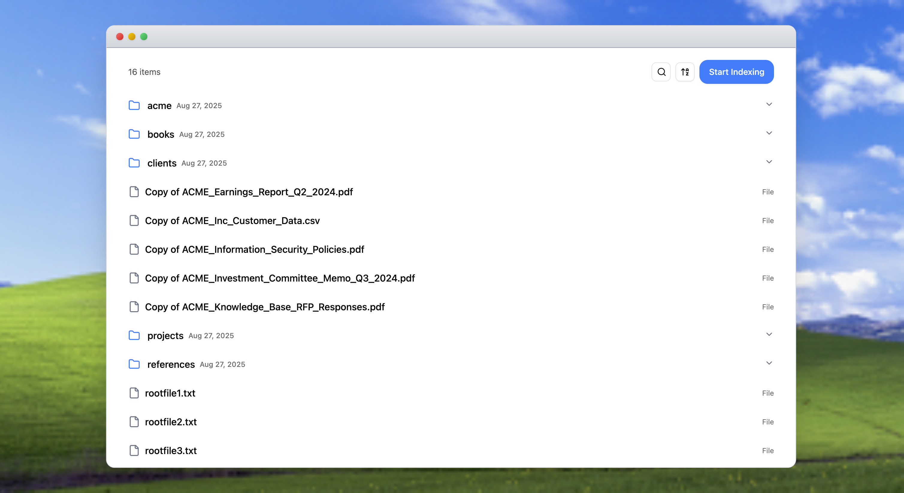

# 📁 File Picker - Stack AI Take-Home Task

A modern, intuitive file picker interface for Google Drive connections with knowledge base indexing capabilities. Built with Next.js, TypeScript, and Tailwind CSS.

## 🖼️ Demo



*File Picker interface showing hierarchical folder structure, search functionality, and indexing capabilities*

## 🎯 Overview

This File Picker provides a Finder-like experience for managing Google Drive files and folders with advanced features for building knowledge bases. Users can browse, search, sort, and selectively index files for AI-powered knowledge management.

## ✨ Key Features

### 🗂️ **File Management**
- **Hierarchical Navigation**: Accordion-style folder expansion with lazy loading
- **Soft Delete**: Remove files from view without deleting from Google Drive
- **Real-time Updates**: Optimistic UI updates with automatic error recovery

### 🔍 **Search & Discovery**
- **Global Search**: Search across all loaded items with real-time filtering
- **Smart Animations**: Smooth search input expansion with contextual controls
- **Path Context**: Shows full file paths in search results

### 📊 **Sorting Options**
- **Name Sorting**: A-Z and Z-A with proper locale-aware collation
- **Date Sorting**: Newest/Oldest with fallback to creation date
- **Per-level Sorting**: Each folder level sorts independently

### 🧠 **Knowledge Base Integration**
- **Selective Indexing**: Choose specific files/folders for knowledge base creation
- **Visual Indicators**: Clear badges showing indexed status
- **Smart Selection**: Parent folder selection automatically includes children
- **Conflict Prevention**: Toast notifications explain selection constraints

### 🎨 **User Experience**
- **Mac-style Window**: Authentic macOS window design with interactive traffic lights
- **Responsive Design**: Adapts to different screen sizes
- **Loading States**: Skeleton screens and loading indicators
- **Error Handling**: Graceful error recovery with user feedback

## 🛠️ Technical Stack

- **Framework**: Next.js 15 (App Router)
- **Language**: TypeScript
- **Styling**: Tailwind CSS
- **Components**: Shadcn/ui
- **Data Fetching**: TanStack Query (React Query)
- **State Management**: React hooks with optimized re-renders
- **Icons**: Lucide React
- **Notifications**: Sonner (toast notifications)

## 🏗️ Architecture Highlights

### **Component Design**
- **Modular Architecture**: Separated concerns with focused components
- **Custom Hooks**: Reusable logic for selection, search, and sorting
- **Performance Optimized**: Minimal re-renders with proper memoization

### **State Management**
- **React Query**: Server state management with caching and background updates
- **Local Storage**: Persistent user preferences and session data (see details below)
- **Optimistic Updates**: Immediate UI feedback with rollback on errors

### **Local Storage Implementation**
The application uses localStorage to persist user data across sessions:

#### **Connection Management**
- **`connectionId`**: Stores the active Google Drive connection ID
- **`orgId`**: Stores the organization ID for API authentication

#### **Knowledge Base State**
- **`knowledge_base_id`**: Persists the current knowledge base ID for indexing operations

#### **File Management**
- **`connection_hidden_ids:${connectionId}`**: JSON array of hidden file/folder IDs
  - Enables "soft delete" functionality without actual deletion
  - Filters out hidden items from the file list display
  - Survives page refreshes and browser sessions

#### **Benefits of localStorage Usage**
- **Session Persistence**: User preferences survive browser refreshes
- **Performance**: Reduces API calls by caching connection data
- **User Experience**: Maintains context between visits
- **Offline Resilience**: Core functionality works without re-authentication

### **API Integration**
- **RESTful Design**: Clean API routes following Next.js conventions
- **Error Handling**: Comprehensive error boundaries and user feedback
- **Type Safety**: Full TypeScript coverage for API responses

## 🚀 Getting Started

### Prerequisites
- Node.js 18+ 
- npm, yarn, or pnpm

### Installation

1. **Clone the repository**
   ```bash
   git clone <repository-url>
   cd file_picker
   ```

2. **Install dependencies**
   ```bash
   npm install
   # or
   yarn install
   # or
   pnpm install
   ```

3. **Set up environment variables**
   ```bash
   cp .env.example .env.local
   ```
   
   Configure your Stack AI credentials:
   ```env
   # Test credentials
   STACK_AI_EMAIL=your_email
   STACK_AI_PASSWORD=your_password
   
   # Backend configuration
   STACK_AI_BACKEND_URL=https://api.stack-ai.com
   
   # Authentication configuration
   STACK_AI_AUTH_URL=your_auth_url
   STACK_AI_ANON_KEY=your_anon_key
   ```

4. **Run the development server**
   ```bash
   npm run dev
   # or
   yarn dev
   # or
   pnpm dev
   ```

5. **Open your browser**
   Navigate to [http://localhost:3000](http://localhost:3000)

## 📁 Project Structure

```
src/
├── app/                          # Next.js App Router
│   ├── api/                      # API routes
│   │   └── stackai/             # Stack AI integration
│   ├── finder/                   # Main file picker page
│   ├── hooks/                    # Global hooks
│   └── providers.tsx             # App-wide providers
├── components/                   # React components
│   ├── hooks/                    # Component-specific hooks
│   ├── ui/                       # Shadcn/ui components
│   ├── ResourceAccordion.tsx     # Folder expansion component
│   ├── ResourceList.tsx          # Main file list
│   ├── SearchControl.tsx         # Animated search input
│   └── ...
└── lib/                          # Utilities
```

## 🎯 Key Components

### **ResourceList**
Main container managing file display, search, and selection modes.

### **ResourceAccordion** 
Handles hierarchical folder navigation with lazy loading and auto-expansion.

### **SearchControl**
Animated search input with smooth expand/collapse transitions.

### **useNestedResourceSelection**
Complex hook managing file selection with parent-child relationships and toast notifications for selection conflicts.

### **useCreateKbWithResources**
Handles knowledge base creation with selected files/folders. Features optimistic UI updates, staging cache management, and automatic sync triggering after KB creation.

### **useKbDeleteResource**
Manages deletion of indexed resources from knowledge bases. Provides clean removal of files from the indexed collection while maintaining data consistency.

### **useGlobalLoadedSearch**
Searches across all cached data without additional API calls.

## 🔧 Development Scripts

```bash
# Development
npm run dev          # Start development server
npm run build        # Build for production
npm run start        # Start production server

# Code Quality
npm run lint         # Run ESLint
npm run format       # Format code with Prettier
```

## 🎨 Design Decisions

### **Performance Optimizations**
- **Hybrid Loading**: Eager first-level loading for immediate UX, then lazy loading for deeper levels
- **Memoization**: Expensive calculations cached with useMemo
- **Efficient Rendering**: Optimized list rendering for large directories
- **Smart Caching**: React Query caches API responses to minimize network calls

### **User Experience**
- **Optimistic Updates**: Immediate feedback with error rollback
- **Loading States**: Skeleton screens prevent layout shift
- **Toast Notifications**: Clear feedback for user actions

### **Code Quality**
- **TypeScript**: Full type safety across the application
- **SOLID Principles**: Clean, maintainable code architecture
- **Custom Hooks**: Reusable logic extraction


The application is deployed on Vercel and ready to use with the Stack AI test environment.


**Built with ❤️ for Stack AI's Frontend Engineer position**
